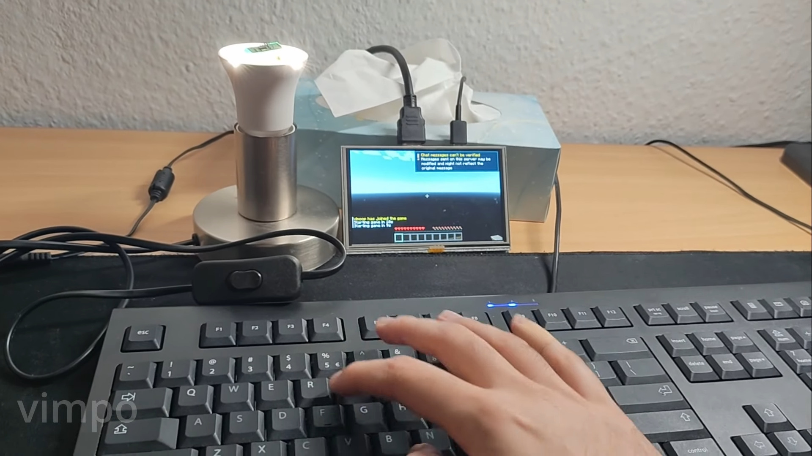
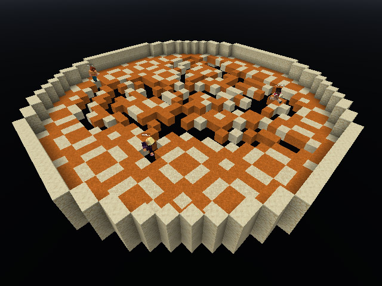

# Minecraft-Server auf einer WLAN-Glühbirne – weil warum nicht

!!! info "Erstellt"
    Von Andy, 10. März 2026 · Übersetzung des Originalartikels von **Mark Tyson**, [10. November 2025](https://www.tomshardware.com/maker-stem/microcontrollers/hardware-hacker-installs-minecraft-server-on-a-cheap-smart-lightbulb-single-192-mhz-risc-v-core-with-276kb-of-ram-enough-to-run-tiny-90k-byte-world) auf Tom's Hardware

---

*Das Ergebnis: Eine Glühbirne aus der Form herausgelöst, Chip freigelegt, USB-Adapter draufgelötet – fertig ist der Server. (Bild: Vimpo)*

---

## Die Kurzfassung

Hardware-Hacker **Vimpo** hat einen Minecraft-Server auf einer billigen WLAN-Glühbirne von AliExpress zum Laufen gebracht. Der Chip darin: ein einzelner **RISC-V-Kern mit 192 MHz**, ausgestattet mit **276 KB RAM** und **128 KB Flash**. Das Ergebnis: ein vollständig spielbarer Mini-Server für bis zu drei gleichzeitige Spieler – betrieben von einer Glühbirne, die weniger kostet als ein Kaffee.

---

## Wie man eine Glühbirne zur Spielkonsole macht

### Schritt 1: Glühbirne aufbrechen

Vimpo beginnt mit einem Messer – und dem Vorteil, dass LED-Glühbirnen kein Vakuum benötigen. Die Glashaube lässt sich also gefahrlos aufsägen. Darunter kommt der eigentliche Star zum Vorschein: ein **BL602-Mikrocontroller** von Bouffalo Lab, umgeben von einem Ring aus LEDs.

Der BL602 bietet:
- **Einzelner RISC-V-Kern** mit bis zu 192 MHz
- **276 KB RAM**
- **128 KB Flash**
- Integriertes **2,4-GHz-WLAN** und **Bluetooth 5**

### Schritt 2: Chip freilegen und verdrahten

Der Mikrocontroller wird ausgelötet und einzelne Drähte an die Header-Pins gelötet. Ein kurzer Funktionstest bestätigt: Glühbirne lässt sich noch ein- und ausschalten. Dann kommt ein USB-zu-Seriell-Adapter dazu, der eine stabile Schnittstelle für Keyboard und Monitor schafft.

*Drei gleichzeitige Spieler – auf einer Glühbirne. Es funktioniert tatsächlich. (Bild: Vimpo)*

### Schritt 3: Software – selbst geschrieben

Handelsübliche Minecraft-Server laufen auf dieser Hardware selbstverständlich nicht. Vimpo hat deshalb eine eigene, radikale Minimalimplementierung entwickelt: **Ucraft**.

Die Kennzahlen sind bemerkenswert:

| Metrik | Wert |
|---|---|
| Binary-Größe (ohne Auth) | **46 KB** |
| Binary-Größe (mit Auth) | **90 KB** |
| RAM-Nutzung (10 Spieler, mit Auth) | **~70 KB** |
| RAM-Nutzung (10 Spieler, ohne Auth) | **~20 KB** |
| Gleichzeitige Spieler (getestet) | **3** |

Ucraft-Quellcode und Build-Anleitung sind auf GitHub verfügbar.

---

## Was läuft – und was nicht

Vimpo selbst schreibt, dass Ucraft „die meisten, wenn nicht alle Features des Vanilla-Servers vermissen lässt." Das ist eine höfliche Untertreibung.

Was funktioniert: Bewegung, Interaktion, Mehrspieler-Synchronisation. Als Showcase dient ein **TNT-Run-Minispiel**, das auf dem Glühbirnen-Server problemlos läuft.

Was nicht funktioniert: Der Rest von Minecraft. Aber das war nie das Ziel.

---

## Minecraft: Das neue Doom

Der Artikel verweist auf einen bemerkenswerten Trend: Minecraft löst langsam Doom als bevorzugten Benchmark für absurde Hardware-Experimente ab:

- **Minecraft auf einem 63 Jahre alten COBOL-Server** implementiert
- **ChatGPT-KI-Modell mit 5 Millionen Parametern** in Minecraft gebaut
- **Minecraft in 8 MB VRAM** auf einer uralten GPU zum Laufen gebracht
- Und jetzt: **Minecraft auf einer Glühbirne**

Doom hat's gut 30 Jahre lang gemacht. Minecraft ist würdiger Nachfolger.

---

## Fazit

Niemand braucht einen Minecraft-Server auf einer Glühbirne. Aber die Frage „Geht das?" ist beantwortet: **Ja. Mit 276 KB RAM. Und drei Spielern gleichzeitig.**

Das Projekt ist kein Witz, sondern echte Hardware-Ingenieurskunst – von der Idee über das Chip-Freilegen bis zur eigenen Server-Implementierung in unter 90 KB. Und es erinnert daran, dass die interessantesten Projekte oft mit der absurdesten Fragestellung beginnen.

---

## Originalquellen

- ➡️ **[Tom's Hardware – Originalartikel](https://www.tomshardware.com/maker-stem/microcontrollers/hardware-hacker-installs-minecraft-server-on-a-cheap-smart-lightbulb-single-192-mhz-risc-v-core-with-276kb-of-ram-enough-to-run-tiny-90k-byte-world)** (Mark Tyson, 10. November 2025)
- 🎥 **[YouTube-Video von Vimpo](https://www.youtube.com/watch?v=JIJddTdueb4)** – Komplette Dokumentation des Projekts
- 💻 **[Ucraft auf GitHub](https://github.com/vimpo/ucraft)** – Quellcode des Glühbirnen-Servers

---

*Erstellt von Andy – 10. März 2026*
