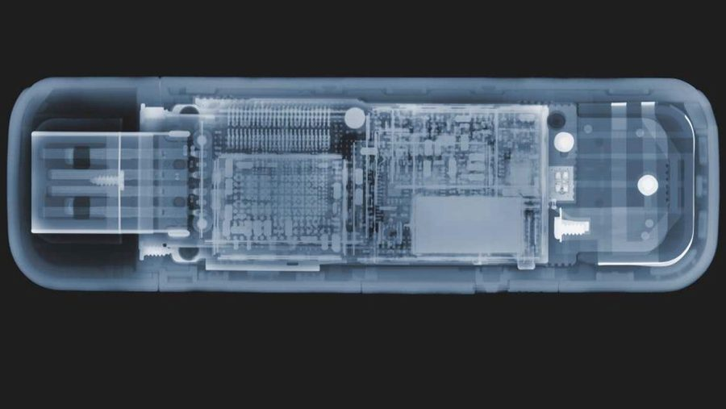

# Wird ein USB-Stick schwerer, wenn man mehr Dateien drauf speichert?

!!! info "Erstellt"
    Von Andy, 10. März 2026 · Übersetzung des Originalartikels von **Dr. Peter Bentley**, [BBC Science Focus Magazine](https://www.sciencefocus.com/future-technology/does-a-usb-drive-get-heavier-as-you-store-more-files-on-it/)

---

*© Getty Images*

---

**Gefragt von: Ben Chelski, Colchester**

Glaubt man es kaum – aber USB-Sticks werden beim Befüllen tatsächlich **leichter**.

---

## Die Antwort

USB-Sticks nutzen Flash-Speicher. Die Einsen und Nullen deiner Daten werden dabei auf **Transistoren** gespeichert.

Beim Speichern einer Datei passiert folgendes:

- Eine **binäre Null** wird gesetzt, indem das sogenannte *Float Gate* des Transistors **aufgeladen** wird
- Eine **binäre Eins** wird gesetzt, indem die Ladung wieder **entfernt** wird

Zum Aufladen werden **Elektronen hinzugefügt** – und jedes Elektron hat eine Masse von:

> **0,00000000000000000000000000091 Gramm**

Das bedeutet: Ein **leerer** USB-Stick (der hauptsächlich Nullen speichert, also geladene Transistoren) ist **schwerer** als ein **voller** USB-Stick (der Einsen und Nullen mischt, also weniger Elektronen enthält).

**Mehr Daten = weniger Elektronen = weniger Gewicht.**

---

## Aber bitte keine Haushaltswaage rausholen

Der Effekt ist real – aber vollkommen unmessbar im Alltag. Man bräuchte alle USB-Sticks der Welt gleichzeitig auf einer Waage, bevor der Gewichtsunterschied auch nur ansatzweise messbar würde.

---

## Originalquelle

➡️ **[sciencefocus.com – „Does a USB drive get heavier as you store more files on it?"](https://www.sciencefocus.com/future-technology/does-a-usb-drive-get-heavier-as-you-store-more-files-on-it/)** (englisch, Dr. Peter Bentley, BBC Science Focus Magazine)

---

*Erstellt von Andy – 10. März 2026*
