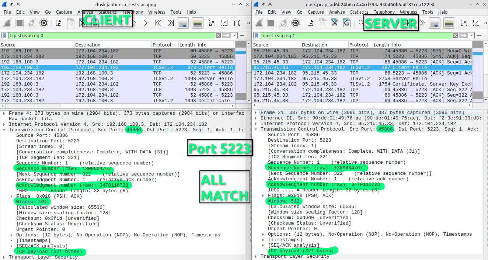
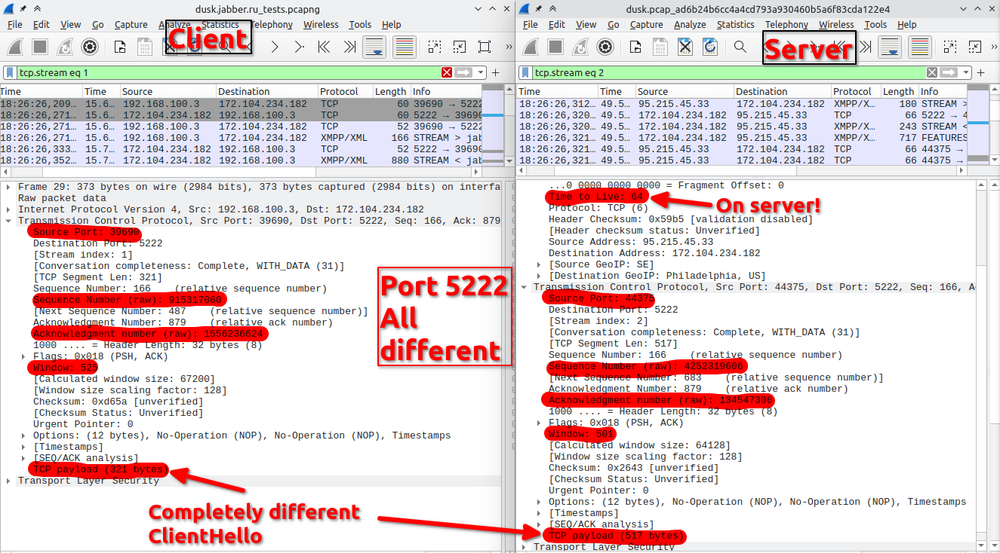

# Abgehört bei Hetzner und Linode: Man-in-the-Middle-Angriff auf jabber.ru

!!! info "Erstellt"
    Von Andy, 10. März 2026 · Übersetzung des Originalberichts von **ValdikSS**, [3. November 2023](https://notes.valdikss.org.ru/jabber.ru-mitm/)

---

## Kurzfassung

Im Oktober 2023 wurde entdeckt, dass der verschlüsselte XMPP-Datenverkehr (Jabber) des größten russischen Messaging-Dienstes **jabber.ru** (alias xmpp.ru) auf den Servern der Hoster **Hetzner** (Deutschland) und **Linode** über Monate hinweg abgehört wurde.

Der Angreifer stellte gefälschte TLS-Zertifikate über Let's Encrypt aus und leitete alle STARTTLS-Verbindungen auf Port 5222 durch einen transparenten **Man-in-the-Middle-Proxy** um. Entdeckt wurde der Angriff nur durch einen Fehler: ein abgelaufenes MitM-Zertifikat, das nicht rechtzeitig erneuert wurde.

!!! warning "Betroffener Zeitraum"
    Mindestens **21. Juli 2023 bis 19. Oktober 2023** (90 Tage bestätigt), möglicherweise bereits seit **18. April 2023** (bis zu 6 Monate). 100 % aller Verbindungen auf Port 5222 waren betroffen.

---

## Wie der Angriff entdeckt wurde

Am **16. Oktober 2023** fiel oxpa, dem erfahrenen Unix-Administrator des seit dem Jahr 2000 betriebenen Dienstes jabber.ru, eine Fehlermeldung auf: „Certificate has expired" – obwohl alle Zertifikate auf dem Server aktuell waren.

Gemeinsam mit anderen Experten und dem ejabberd-Entwickler wurde festgestellt:

- Die Software selbst liefert ein gültiges, nicht abgelaufenes Zertifikat
- Das abgelaufene Zertifikat ist **nicht auf dem Server vorhanden**
- Es basiert auf einem **fremden Private Key** und wurde nie vom ACME-Script des Servers ausgestellt
- Eingehende TCP-Verbindungen auf Port 5222 sind **verändert**: abweichende Quellports, SEQ/ACK-Nummern, TTL=64 ohne Zwischenhops
- Port 5223 (XMPP TLS direkt) ist **nicht betroffen**

---

## Netzwerk-Traffic im Vergleich

**Port 5223 – unberührt, Daten intakt:**



**Port 5222 – Verbindung auf Anwendungsebene (L7) gekapert:**



Der Server empfängt auf Port 5222 ein **ersetztes ClientHello** vom Angreifer – der echte Client kommuniziert dabei unwissentlich mit dem MitM-Proxy, nicht mit jabber.ru.

---

## Untersuchung: Kein Server-Hack

Das Team führte eine gründliche Analyse beider Server durch:

- Logs, Datei-Zeitstempel, laufende Prozesse, Memory Maps
- Suche nach `LD_PRELOAD`-Hijacking mit statisch kompiliertem Busybox
- Kernel-Memory-Dump mit LiME + Volatility-Analyse

**Ergebnis: Keine Anzeichen einer Server-Kompromittierung.**

Einzige Auffälligkeit: Der Hetzner-Server verlor am **18. Juli 2023** für exakt 19 Sekunden die physische Netzwerkverbindung:

```
[Tue Jul 18 12:58:29 2023] igb 0000:04:00.0 enp4s0: igb: enp4s0 NIC Link is Down
[Tue Jul 18 12:58:48 2023] igb 0000:04:00.0 enp4s0: igb: enp4s0 NIC Link is Up 1000 Mbps Full Duplex
```

Genau zu diesem Zeitpunkt wurden die ersten gefälschten Zertifikate ausgestellt.

---

## Untersuchung: Netzwerkebene

Auch auf Netzwerkebene zeigte sich, dass kein gewöhnliches ARP-Spoofing oder Routing-Angriff durch Nachbarknoten stattfand:

- Kein veränderter Gateway-MAC
- Keine doppelten ARP-Antworten
- Keine fremden Routing-Regeln oder IPsec-Tunnel

Besonders auffällig bei den betroffenen **Linode VMs**: Sie konnten ihre Nachbar-IPs im selben Netzwerksegment nicht erreichen (kein ARP-Discovery, kein Ping) – während ein unbeteiligter Linode-Server im selben Netz normal kommunizierte.

Traceroute-Vergleich:

| Ziel | Port | Hops | Auffälligkeit |
|---|---|---|---|
| Linode (anderes VPS) | 22 | 13 | Normal |
| jabber.ru Linode | **5222** | 13 | ← **selber Hop wie SSH!** |
| jabber.ru Linode | 22 (SSH) | **14** | Zusätzlicher versteckter Hop |

Der Port-5222-Traffic kommt beim **gleichen Hop** an wie nicht-manipulierter Traffic auf anderen Servern – SSH des betroffenen Servers benötigt jedoch **einen zusätzlichen, unsichtbaren Hop**. Das bedeutet: Eine zwischengeschaltete Maschine terminiert Port 5222 selbst und leitet alle anderen Ports transparent an das echte Ziel weiter.

---

## Die gefälschten Zertifikate

In der Certificate Transparency Datenbank **crt.sh** wurden mehrere Zertifikate gefunden, die **nicht vom jabber.ru-Server ausgestellt** wurden:

| Domain | Serial (Auszug) | Gültig ab | Gültig bis | Im MitM eingesetzt |
|---|---|---|---|---|
| xmpp.ru | `03:f3:68…` | 18.07.2023 | 16.10.2023 | ✅ |
| xmpp.ru | `04:9c:2d…` | 13.10.2023 | 11.01.2024 | ✅ |
| jabber.ru | `03:43:75…` | 18.04.2023 | 17.07.2023 | ❓ |
| jabber.ru | `04:4c:1c…` | 18.07.2023 | 16.10.2023 | ✅ |
| jabber.ru, xmpp.ru | `04:d1:d2…` | 25.04.2023 | 24.07.2023 | ❓ |
| jabber.ru, xmpp.ru | `04:b7:85…` | 25.04.2023 | 24.07.2023 | ✅ |

Das erste bestätigte Ausstellungsdatum: **18. Juli 2023** – der Tag des 19-sekündigen Netzwerkausfalls auf dem Hetzner-Server.

---

## Fingerabdruck des MitM-Proxys

Mit `testssl.sh` wurde ein weiteres Erkennungsmerkmal entdeckt: Der MitM-Proxy akzeptiert **anonyme Cipher Suites** (keine Authentifizierung):

```
Anonymous NULL Ciphers (no authentication)    offered (NOT ok)    ←←←
```

Diese Konfiguration ist extrem ungewöhnlich – reguläre TLS-Bibliotheken unterstützen anonyme Cipher Suites standardmäßig nicht, selbst wenn sie in der Konfiguration explizit erlaubt werden. Keine der ca. 20 anderen getesteten XMPP-Dienste zeigte dieses Verhalten.

---

## Zusammenfassung und Bewertung

- Der Angreifer ließ sich seit **18. April 2023** (frühestens) gefälschte TLS-Zertifikate via Let's Encrypt ausstellen
- Der MitM-Angriff war mindestens vom **21. Juli bis 19. Oktober 2023** aktiv – **100 % der STARTTLS-Verbindungen** auf Port 5222 betroffen
- Der Angriff wurde durch ein **abgelaufenes MitM-Zertifikat** entdeckt, das nicht rechtzeitig erneuert wurde
- Der Angriff endete kurz nach Beginn der Untersuchung und nach Tickets an Hetzner/Linode-Support
- **Beide Server wurden nicht gehackt** – die Umleitung erfolgte auf Infrastrukturebene der Hoster

!!! danger "Was der Angreifer konnte"
    Da der MitM-Proxy die komplette verschlüsselte Verbindung terminierte, konnte der Angreifer:

    - Den gesamten Nachrichtenverlauf mitlesen
    - Nachrichten in Echtzeit verändern
    - Alle Aktionen im Namen des Nutzers ausführen – **ohne das Passwort zu kennen**
    - Kontaktlisten einsehen

    Nur Ende-zu-Ende-verschlüsselte Kommunikation (OMEMO, OTR, PGP) mit **verifizierten Schlüsseln** war geschützt.

---

## Einschätzung: Staatliche Überwachung

> *„Wir tendieren dazu anzunehmen, dass es sich um eine rechtmäßige Überwachungsmaßnahme handelt, zu der Hetzner und Linode auf Anfrage der deutschen Polizei verpflichtet wurden."*
> — ValdikSS

Die Antworten der Hoster bestätigten diese Einschätzung implizit:

**Hetzner:**
> *„Leider können wir hier keine weiteren Lösungen vorschlagen. Ich verstehe aus Ihrer Antwort, dass das Problem behoben wurde."*

**Linode (Akamai):**
> *„Wir haben keine illegalen Aktivitäten festgestellt, die Ihre Dienste beeinträchtigen, und schließen dieses Ticket."*

Keine Stellungnahme zum eigentlichen Sachverhalt – eine klassische Formulierung bei behördlich angeordneter Geheimhaltung.

---

## Wie man sich schützen kann

1. **Certificate Transparency Monitoring** – Tools wie [Cert Spotter](https://github.com/SSLMate/certspotter) melden neue Zertifikate für eigene Domains sofort
2. **CAA-Einträge** mit ACME-Account-Bindung (RFC 8657) – verhindert, dass andere Accounts Zertifikate für die Domain ausstellen
3. **Externes TLS-Monitoring** auf allen eigenen Diensten
4. **XMPP Channel Binding** (SCRAM PLUS) – erkennt MitM auch bei gültigem Zertifikat
5. **MAC-Adress-Monitoring** des Default-Gateways

---

## Originalquelle

➡️ **[notes.valdikss.org.ru/jabber.ru-mitm/](https://notes.valdikss.org.ru/jabber.ru-mitm/)** (englisch, ValdikSS, 3. November 2023)

---

*Erstellt von Andy – 10. März 2026*
